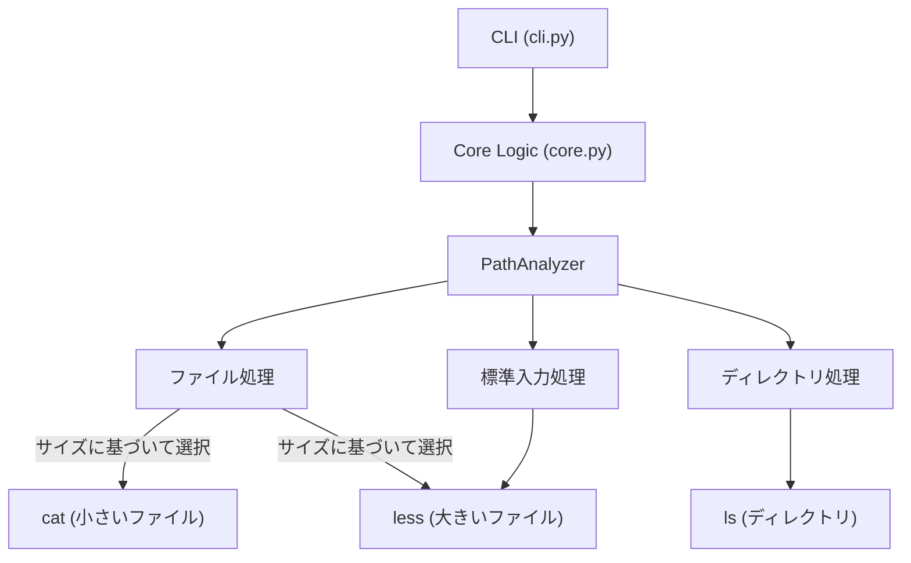
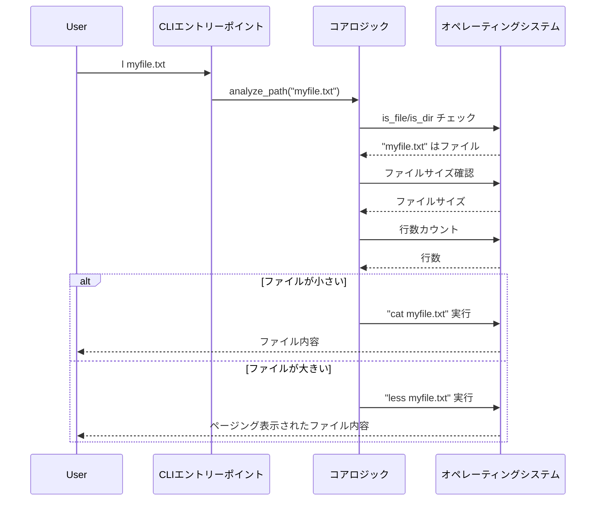

# The L Command - シンプル実装計画

## プロジェクト概要

README.mdから理解できること:

1. `l` コマンドは、ターゲットに基づいて `less`、`cat`、または `ls` を適切に使い分ける
2. MVPでは以下を実装する:
   - ファイルとディレクトリの区別
   - 大きなファイル（50行以上または5KB以上）には `less` を使用
   - 小さなファイルには `cat` を使用
   - ディレクトリには `ls` を使用
3. 標準入力の処理をサポート

## シンプルなアーキテクチャ



## MVPのプロジェクト構造

```
l-command/
├── README.md
├── LICENSE
├── pyproject.toml       # プロジェクトメタデータ、ビルド設定
├── setup.py             # 後方互換性のため
├── src/
│   └── l_command/
│       ├── __init__.py
│       ├── cli.py           # コマンドラインインターフェースのエントリーポイント
│       ├── core.py          # パス分析とディスパッチのコアロジック
│       └── constants.py     # 定数（閾値など）
└── tests/                   # 単体テストと統合テスト
```

## 実装詳細

### コア処理フロー



### コード概要

#### cli.py

コマンドラインインターフェースのエントリーポイント:

```python
#!/usr/bin/env python3
import sys
import argparse
from l_command.core import analyze_path

def main():
    parser = argparse.ArgumentParser(description='スマートなファイル・ディレクトリビューア')
    parser.add_argument('path', nargs='?', default=None, help='表示するファイルまたはディレクトリパス')
    parser.add_argument('-v', '--version', action='store_true', help='バージョン情報を表示')
    args = parser.parse_args()

    if args.version:
        print("l command v0.1.0")
        return 0

    # 標準入力があるか確認
    if not sys.stdin.isatty():
        return analyze_path(None)  # Noneは標準入力を意味する

    # パスが指定されていなければカレントディレクトリを使用
    path = args.path or '.'
    return analyze_path(path)

if __name__ == '__main__':
    sys.exit(main())
```

#### core.py

コアロジック:

```python
import os
import sys
import subprocess
from l_command.constants import SIZE_THRESHOLD, LINE_THRESHOLD

def analyze_path(path):
    """
    パスを分析し、適切なコマンドで表示する

    Args:
        path: 表示するパス。Noneの場合は標準入力を処理

    Returns:
        int: 終了コード
    """
    # 標準入力の処理
    if path is None:
        return handle_stdin()

    # ディレクトリの処理
    if os.path.isdir(path):
        return handle_directory(path)

    # ファイルの処理
    if os.path.isfile(path):
        return handle_file(path)

    # パスが存在しない場合
    print(f"Error: Path not found: {path}")
    return 1

def handle_stdin():
    """標準入力を処理する"""
    # 標準入力を less にパイプ
    process = subprocess.run(['less'], stdin=sys.stdin)
    return process.returncode

def handle_directory(path):
    """ディレクトリを処理する"""
    # ls コマンドで表示
    process = subprocess.run(['ls', '-la', path])
    return process.returncode

def handle_file(path):
    """ファイルを処理する"""
    # ファイルサイズを取得
    file_size = os.path.getsize(path)

    # 行数をカウント
    line_count = count_lines(path)

    # サイズまたは行数に基づいて cat か less を選択
    if file_size < SIZE_THRESHOLD and line_count < LINE_THRESHOLD:
        process = subprocess.run(['cat', path])
    else:
        process = subprocess.run(['less', path])

    return process.returncode

def count_lines(path):
    """ファイルの行数を効率的にカウントする"""
    lines = 0
    with open(path, 'rb') as f:
        for _ in f:
            lines += 1
    return lines
```

#### constants.py

定数と設定:

```python
# ファイルサイズの閾値 (5KB)
SIZE_THRESHOLD = 5 * 1024

# 行数の閾値
LINE_THRESHOLD = 50
```

## 実装計画

### フェーズ1: MVP (Minimum Viable Product)

1. **プロジェクト構造のセットアップ** (0.5日)
   - プロジェクトの基本構造を作成
   - ビルド設定を構成

2. **コア機能** (1.5日)
   - パス分析の実装
   - ファイルサイズ/行数検出の実装
   - ファイル、ディレクトリ、標準入力の基本ハンドラの実装

3. **テストと文書化** (1日)
   - 単体テストの作成
   - コードドキュメント
   - READMEの更新

4. **パッケージング** (1日)
   - Pythonホイールの作成
   - インストールと基本機能のテスト

### フェーズ2: 将来の拡張（MVP完了後）

1. **基本的な設定システム** (1日)
   - 設定ファイルの追加（TOML形式）
   - 動作の設定可能化

2. **色付き出力サポート** (1日)
   - ディレクトリリストの色付け
   - テキストファイルの構文強調表示

3. **モジュール構造へのリファクタリング** (1日)
   - 分離したハンドラモジュールの作成
   - より拡張性の高いアーキテクチャへの移行

4. **特殊ファイルタイプハンドラ** (2-3日)
   - JSONフォーマット（jqを使用）
   - YAMLフォーマット
   - Markdownレンダリング
   - CSV/TSVテーブルフォーマット

5. **プラグインシステム** (2-3日)
   - プラグインの発見とロードの実装
   - プラグインAPIの定義
   - サンプルプラグインの作成

## 技術的考慮事項

1. **クロスプラットフォーム互換性**
   - 実行ファイルを見つけるために `shutil` を使用
   - WindowsとUnix間のパスの違いを処理

2. **エラー処理**
   - 依存関係の欠如を適切に処理
   - 役立つエラーメッセージの提供

3. **パフォーマンス**
   - ファイル全体を読み込まずにファイルサイズを効率的に確認
   - ファイル行数の効率的なカウント

4. **セキュリティ**
   - 外部コマンド実行時のシェルインジェクションを回避

## 次のステップ

1. プロジェクト初期構造の作成
2. コアMVP機能の実装
3. テストと文書化の追加
4. Pythonホイールとしてパッケージ化

## 将来の拡張計画

MVPが完成した後の拡張計画として、以下のプラグインシステムと設定管理の仕組みが考えられます。

### プラグインのTOML設定

プラグインは将来的にTOML設定ファイルを通じて管理できるようにします:

```toml
[plugins]
# プラグインシステムの有効/無効
enabled = true

# プラグイン検索パス（デフォルトパスに追加）
paths = [
    "/custom/plugin/path",
    "~/my-l-plugins"
]

# プラグイン固有の設定
[plugins.json]
enabled = true
pretty_print = true
max_preview_size = 10240
jq_path = "/usr/bin/jq"

[plugins.markdown]
enabled = true
renderer = "glow"  # "glow", "mdcat" などから選択
theme = "dark"

[plugins.archive]
enabled = true
list_nested = true
max_depth = 3
```

### 設定ファイルの検索順序

設定ファイルは以下の順序で検索し、後に見つかった設定が優先されるようにします:

1. システム全体の設定: `/etc/l_command/config.toml`
2. ユーザー固有の設定: `~/.config/l_command/config.toml`
3. プロジェクト固有の設定: `./.l_command.toml`

複数の設定ファイルがある場合は、プロジェクト > ユーザー > システムの優先順位でマージされます。

## 拡張機能（将来像）

- カラー出力サポート（`ls` のカラー、`less` のシンタックスハイライト）
- JSON以外の形式（YAML / Markdown など）の自動整形表示
  - 大きなファイルのサンプル表示（例: `.[:10]` などの形式）
  - ページネーションやカラム表示の自動最適化（端末サイズに応じて）
  - シンボリックリンクの解決・表示オプション
  - Git リポジトリ内では `git ls-files` にフォールバック
  - テキストファイルとバイナリファイルの適切な処理：
    - **シンタックスハイライト系（テキストファイル）**
        - `bat` による構文強調表示（.sh, .py, .js, .json, .yml など）
        - `glow` や `mdcat` による Markdown 表示
        - `yq` による YAML 整形・構造表示
        - `.csv`, `.tsv` ファイルには `column -t -s,` による表形式整形表示
        - `.log` ファイルにはカラーフィルタ（`ccze`, `grc`, `lnav` など）を通して視認性向上
    - **バイナリ対応系（非テキストファイル）**
        - `xxd`, `hexdump` による16進表示
        - `file` でバイナリ検出後、画像なら `viu`、PDFなら `pdftotext`、音声/動画なら `mediainfo` を利用
        - `.zip`, `.tar.gz` などのアーカイブは `unzip -l`, `tar -tzf` などで中身一覧表示
        - バイナリファイルには自動でメタ情報だけを表示
