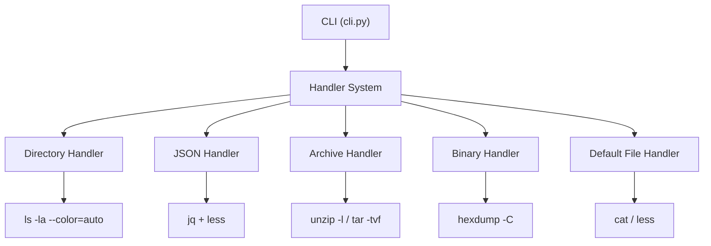
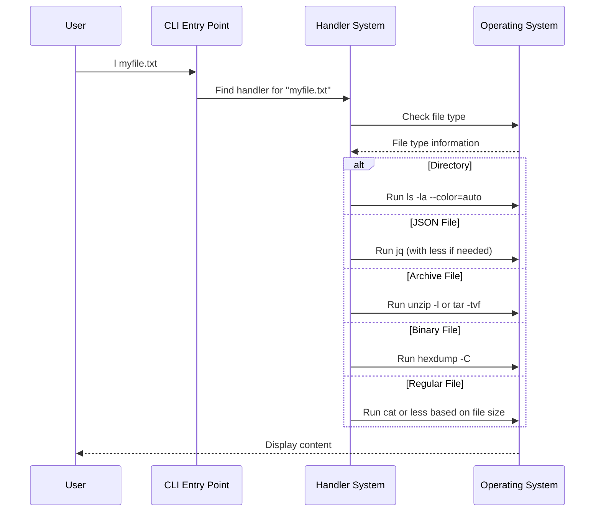

# The L Command - Implementation Plan

## Project Status

The L Command has evolved from the initial MVP plan to a more structured, handler-based architecture. This document outlines the current implementation and future plans.

## Current Architecture



## Current Project Structure

```
l-command/
├── README.md
├── LICENSE
├── CONTRIBUTING.md
├── pyproject.toml       # Project metadata, build settings
├── src/
│   └── l_command/
│       ├── __init__.py
│       ├── cli.py           # CLI entry point
│       ├── constants.py     # Constants
│       ├── utils.py         # Utility functions
│       └── handlers/        # File type handlers
│           ├── __init__.py
│           ├── base.py      # Base handler class
│           ├── default.py   # Default file handler
│           ├── directory.py # Directory handler
│           ├── json.py      # JSON handler
│           ├── archive.py   # Archive handler
│           └── binary.py    # Binary handler
└── tests/                   # Unit and integration tests
```

## Execution Flow



## Implemented Features

1. **Handler-Based Architecture**
   - Modular system with prioritized handlers
   - Each handler implements `can_handle()` and `handle()` methods
   - Easy to extend with new file type handlers

2. **File Type Support**
   - Directory listing with `ls -la --color=auto`
   - JSON file detection and formatting with `jq`
   - Archive file listing (ZIP, TAR, etc.)
   - Binary file display with `hexdump`
   - Regular file display with `cat` or `less` based on file size

3. **Smart Detection**
   - Extension-based detection
   - Content-based detection for files without extensions
   - Terminal height detection for appropriate paging

4. **Error Handling**
   - Graceful fallbacks when tools are missing
   - Appropriate error messages
   - Size limit checks to prevent performance issues

## Future Development Plans

### Phase 1: Additional File Type Handlers

1. **YAML Handler** (1 day)
   - Detection by extension (.yml, .yaml) and content
   - Formatting with `yq`
   - Fallback to default handler if `yq` is not available

2. **Markdown Handler** (1 day)
   - Detection by extension (.md, .markdown)
   - Rendering with `glow` or `mdcat`
   - Fallback to default handler if renderer is not available

3. **CSV/TSV Handler** (1 day)
   - Detection by extension (.csv, .tsv) and content
   - Formatting with `column -t -s,`
   - Horizontal scrolling support with `less -S`

### Phase 2: Configuration System

1. **Configuration File Support** (2 days)
   - TOML configuration file
   - System, user, and project-specific configurations
   - Handler-specific settings

2. **Command Line Options** (1 day)
   - Force specific handler with flags (e.g., `--json`, `--binary`)
   - Override default behavior (e.g., `--no-color`, `--raw`)
   - Version and help information

### Phase 3: Advanced Features

1. **Plugin System** (3 days)
   - Plugin discovery and loading
   - Plugin API definition
   - Sample plugins

2. **Enhanced Display Options** (2 days)
   - Syntax highlighting for code files using `bat`
   - Image preview in terminal with `viu` or similar
   - PDF metadata/preview with `pdftotext`

3. **Performance Optimizations** (2 days)
   - Streaming for large files
   - Caching for repeated access
   - Parallel processing for multiple files

## Technical Considerations

1. **Cross-Platform Compatibility**
   - Use `shutil.which()` to find executables
   - Handle path differences between Windows and Unix
   - Provide fallbacks for platform-specific tools

2. **Error Handling**
   - Gracefully handle missing dependencies
   - Provide helpful error messages
   - Implement appropriate fallbacks

3. **Performance**
   - Efficiently check file size without loading entire file
   - Efficient line counting
   - Streaming for large files

4. **Security**
   - Avoid shell injection in external command execution
   - Validate user input
   - Handle file permissions appropriately

## Next Steps

1. Implement YAML, Markdown, and CSV handlers
2. Add configuration system
3. Enhance documentation
4. Add more tests to improve coverage
5. Implement plugin system

## Configuration System Design

The configuration system will use TOML files with the following structure:

```toml
[general]
default_handler = "auto"  # auto, text, binary, etc.
color = true
max_file_size = 10485760  # 10MB

[handlers]
# Enable/disable specific handlers
directory = true
json = true
archive = true
binary = true
yaml = true
markdown = true
csv = true

# Handler-specific settings
[handlers.json]
max_size = 10485760  # 10MB
jq_path = "/usr/bin/jq"
jq_args = ["."]

[handlers.archive]
list_nested = true
max_depth = 3

[handlers.markdown]
renderer = "glow"  # glow, mdcat, etc.
theme = "dark"
```

Configuration files will be searched in the following order:
1. System-wide: `/etc/l_command/config.toml`
2. User-specific: `~/.config/l_command/config.toml`
3. Project-specific: `./.l_command.toml`

When multiple configuration files exist, they will be merged with project > user > system priority.
